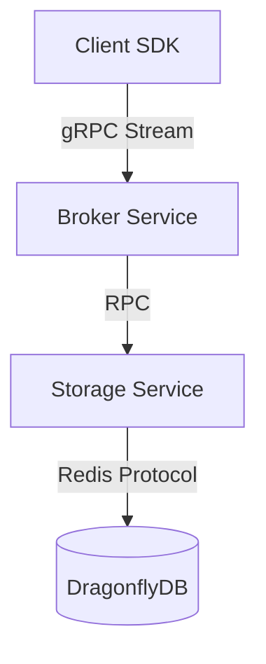

# GMQ 架构演进：从单机到分布式高可用

## 🚀 核心变更：全面拥抱 DragonflyDB

为了满足生产级的高性能和数据一致性要求，GMQ 完成了从本地文件存储向 **Redis 兼容协议 (DragonflyDB)** 的全面演进。

### 1. 存储引擎升级：DragonflyDB
- **高性能**：DragonflyDB 作为现代化的 Redis 替代者，在多线程性能和内存利用率上具有显著优势。
- **消息流模型**：利用 Redis Streams 实现消息的高效持久化、顺序保证和消费确认（Ack）。
- **分布式一致性**：所有 Broker 共享同一个 Dragonfly 集群，确保消费者状态和 Offset 在分布式环境下强一致。

### 2. 组件架构精简：Broker 统一代理
- **Gateway + Dispatcher → Broker**：合并了连接管理层和分发逻辑层。
- **低延迟**：减少了一层内部 gRPC 转发，显著降低了消息推送的端到端延迟。
- **全无状态**：Broker Service 不再持有任何内存状态，所有的消费者分配信息、分区元数据均下沉至 DragonflyDB。

### 3. 增强的 QoS 保证
- **QoS 1 (At Least Once)**：通过 `XTRIM` 和 `ACK` 机制，确保消息在所有消费组都成功处理前不会被物理删除。
- **高精度 Offset**：采用 `(timestamp << 20) | sequence` 编码，完美映射 Redis ID，确保消费重启后能够毫秒级精准恢复进度。
- **生产幂等性**：基于 Redis `SETNX` 的去重窗口，防止生产端重复发送。

## 📊 最终架构拓扑

- **Client SDK**：负责生产/消费逻辑，支持自动重连、心跳和背压处理。
- **Broker Service**：无状态代理，处理连接接入、分区分配逻辑。
- **Storage Service**：存储协议转换层，屏蔽底层存储实现细节。
- **DragonflyDB**：存储核心，承载消息数据、Offset 和元数据。

## 🛠️ 管理与运维

- **快速启动**：使用 `make up` 即可通过 Docker Compose 一键拉起完整集群。
- **监控**：DragonflyDB 完美兼容 Redis 监控工具（如 Prometheus Redis Exporter）。
- **扩展**：Broker Service 可根据 CPU/网络负载随时进行 K8s 水平扩容。

---
**架构师笔记**: 移除本地文件存储实现（FileStorage）标志着 GMQ 架构的成熟。现在系统不再受限于单机磁盘，而是成为了一个真正的、可水平扩展的现代分布式消息队列。
